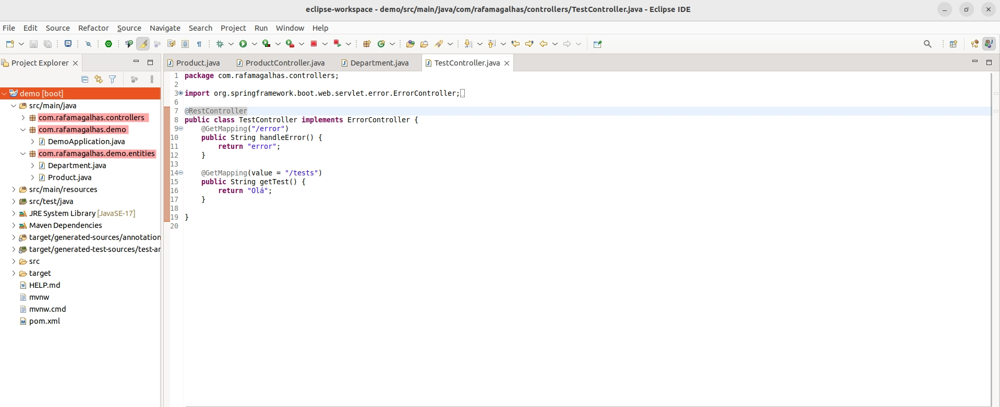
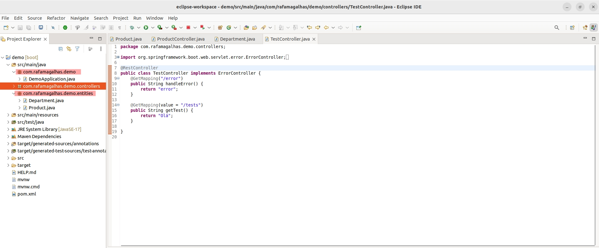

# Whitelabel Error Page

A página de erro de whitelabel é gerada pelo Spring Boot como um mecanismo padrão quando nenhuma página de erro personalizada é encontrada. Quando a página de erro Whitelabel estiver desativada e nenhuma página de erro personalizada for fornecida, você verá a página de erro gerada pelo servidor de aplicativos da Web subjacente, como Tomcat, Undertow, Jetty, etc.

O detalhe que gerou essa mensagem na minha aplicação, foi o nome do pacote não estar seguindo o padrão dos demais, conforme imagem abaixo:

Após ajustar o nome do pacote, deixando-o em conformidade com os demais, como na imagem abaixo, a aplicação funcionou corretamente.

Testar após o ajuste.